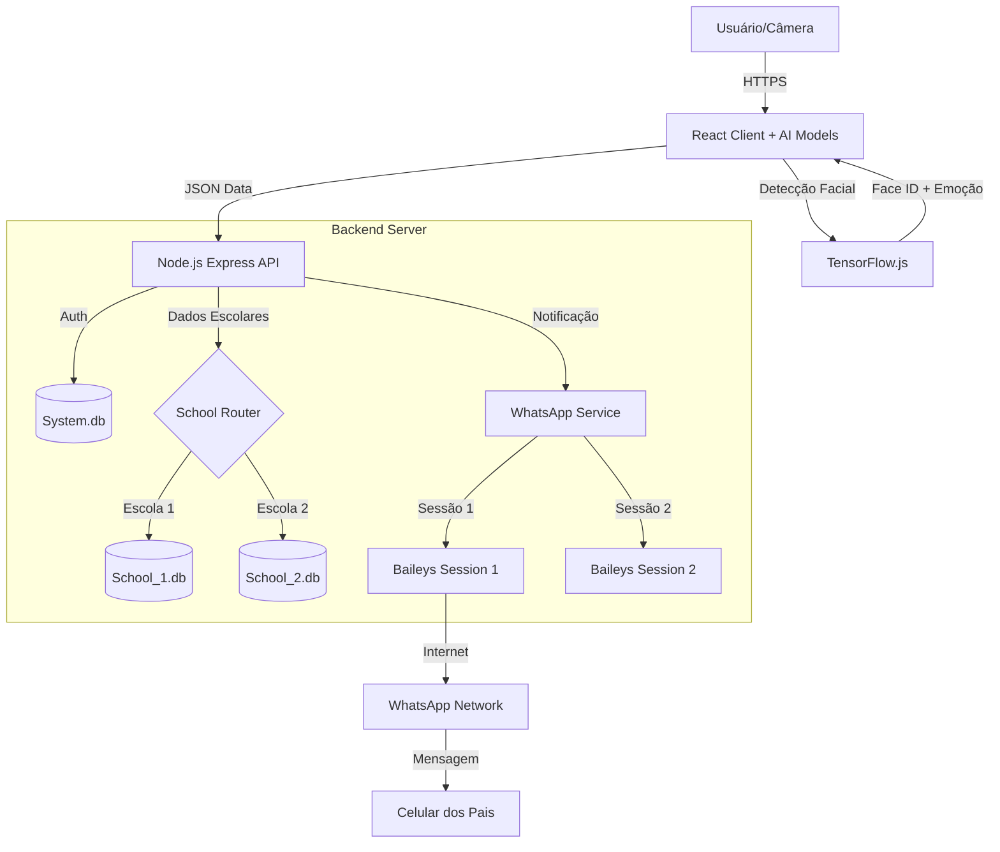

# 🎓 EduFocus - Ecossistema de Inteligência Educacional

> **Transformando câmeras de segurança em ferramentas de gestão pedagógica e engajamento escolar.**

[](https://github.com/leopalmeira/edufocus1)
[](https://nodejs.org/)
[](https://reactjs.org/)
[](https://www.tensorflow.org/js)
[](https://github.com/WhiskeySockets/Baileys)
[](https://render.com/deploy?repo=https://github.com/leopalmeira/UNICO)

---

## 📖 O Que é o EduFocus na Prática?

O **EduFocus** não é apenas um sistema de gestão escolar. É uma plataforma de **Inteligência Artificial aplicada** que resolve três dores críticas das instituições de ensino modernas: **Segurança, Comunicação e Engajamento.**

Diferente de sistemas passivos, o EduFocus age ativamente:
1.  **Segurança Ativa:** Identifica quem entra e sai da escola em milissegundos.
2.  **Comunicação Imediata:** Avisa os pais *no momento exato* que o aluno pisa na escola, com foto, via WhatsApp (onde eles realmente olham).
3.  **Pedagogia Baseada em Dados:** Analisa se os alunos estão felizes, atentos ou entediados durante a aula, sem interromper o professor.

Tudo isso rodando em uma arquitetura **Multi-tenant robusta**, permitindo que uma única instalação gerencie dezenas de escolas com total isolamento de dados.

---

## 💡 Casos de Uso Reais

### 👪 Para os Pais: "Paz de Espírito Instantânea"
> *"Será que meu filho chegou bem?"* 
O sistema elimina essa dúvida. No momento em que o aluno passa pela catraca ou porta, a câmera reconhece o rosto, e o pai recebe uma mensagem no WhatsApp:
> **"✅ Olá! O aluno Pedro Silva acabou de chegar na Escola Modelo às 07:05. [Ver Foto]"**

### 🏫 Para a Direção: "Visão de Raio-X da Escola"
O diretor não precisa adivinhar como está o clima escolar. O dashboard mostra em tempo real:
- **Frequência:** 95% dos alunos presentes hoje.
- **Clima Emocional:** A turma 301B está "Triste/Cansada" hoje? Talvez seja hora de uma intervenção pedagógica.
- **Segurança:** Alerta imediato de pessoas não autorizadas.

### 👩‍🏫 Para Professores: "Foco no Ensino, Não na Chamada"
O professor entra em sala e começa a aula. A câmera faz a chamada silenciosamente.
- **Zero tempo perdido** gritando nomes.
- **Análise de Engajamento:** O sistema avisa se a turma está perdendo o interesse, permitindo ajustar a didática na hora.

### 🛠️ Para Técnicos e Instaladores: "Instalação Descomplicada"
Painel dedicado para vincular câmeras IP/RTSP a salas específicas com poucos cliques, testar conexões e ajustar ângulos de visão sem precisar acessar o servidor principal.

---

## 🏗️ Arquitetura Técnica Profunda

O sistema foi desenhado para ser escalável, seguro e econômico.

### 1. Núcleo de Inteligência Artificial (Edge AI)
Utilizamos **TensorFlow.js** e **face-api.js** rodando diretamente no navegador (Client-side) ou em servidores de borda.
*   **Privacidade:** As imagens não precisam ser enviadas para nuvens de terceiros (como AWS Rekognition ou Azure), o processamento é local.
*   **Custo Zero:** Não há cobrança por API de reconhecimento facial.
*   **Performance:** Latência mínima, feedback visual em tempo real (< 100ms).

### 2. Motor de Comunicação WhatsApp (Baileys)
Em vez de pagar centavos de dólar por mensagem na API oficial (o que inviabilizaria o projeto para escolas públicas), utilizamos a biblioteca **Baileys**.
*   **Simulação Real:** O sistema se comporta como um WhatsApp Web real.
*   **Sessões Persistentes:** As sessões de cada escola são salvas em arquivos locais (`auth_info_baileys`), permitindo reinicializações sem perder a conexão.
*   **Filas de Envio:** Sistema inteligente de filas para evitar bloqueios por spam.

### 3. Multi-tenancy Real (Isolamento Lógico e Físico)
Para garantir que dados da "Escola A" nunca vazem para a "Escola B":
*   **Banks Isolados:** Cada escola tem seu próprio arquivo SQLite (`school_1.db`, `school_2.db`). Isso facilita backups individuais e migrações.
*   **Banco Sistema:** Um banco global (`system.db`) gerencia apenas as credenciais de super admins e a lista de escolas.
*   **Roteamento Dinâmico:** O Middleware `getSchoolDB(id)` conecta automaticamente ao banco correto baseado no token do usuário logado.

---

### Diagrama de Fluxo de Dados



---

## 📋 Índice

- [Sobre o Projeto](#-sobre-o-projeto)
- [Arquitetura e Tecnologias](#-arquitetura-e-tecnologias)
- [Funcionalidades Principais](#-funcionalidades-principais)
- [Regras de Negócio](#-regras-de-negócio)
- [Instalação e Configuração](#-instalação-e-configuração)
- [Estrutura do Projeto](#-estrutura-do-projeto)
- [Fluxos do Sistema](#-fluxos-do-sistema)
- [API e Endpoints](#-api-e-endpoints)
- [Segurança](#-segurança)
- [Contribuindo](#-contribuindo)
- [Licença](#-licença)

---

## ✨ Funcionalidades Principais

### 1. 📸 Reconhecimento Facial e Controle de Presença

**Tecnologia:** face-api.js + TensorFlow.js

**Funcionalidades:**
- Detecção de rostos em tempo real via webcam
- Reconhecimento de alunos cadastrados (precisão >95%)
- Registro automático de presença (entrada/saída)
- Prevenção de duplicatas (mesmo aluno no mesmo dia)
- Captura e armazenamento de fotos em base64

**Fluxo:**
1. Professor ativa câmera na sala
2. Sistema detecta rostos continuamente
3. Compara com banco de dados de alunos
4. Registra presença automaticamente
5. Envia notificação WhatsApp para responsável

### 2. 😊 Análise de Emoções em Tempo Real

**Tecnologia:** face-api.js Emotion Recognition Model

**Emoções Detectadas:**
- 😊 Feliz (Happy)
- 😢 Triste (Sad)
- 😠 Raiva (Angry)
- 😨 Medo (Fearful)
- 😲 Surpreso (Surprised)
- 🤢 Nojo (Disgusted)
- 😐 Neutro (Neutral)

**Aplicações:**
- Monitoramento de engajamento em aula
- Identificação de alunos com dificuldades
- Métricas de satisfação por turma
- Alertas para professores

### 3. 📱 Notificações WhatsApp Automatizadas

**Tecnologia:** Baileys (WhatsApp Web API)

**Funcionalidades:**
- Conexão multi-tenant (uma por escola)
- Envio de cards visuais personalizados
- Notificações de chegada/saída
- Mensagens de professores para responsáveis
- Persistência de sessão

**Card Visual (320x120px):**
```
┌────────────────────────────────────┐
│ [FOTO] NOME DO ALUNO        ✓CHEGOU│
│        🎓 Nome da Escola           │
│        📚 Turma  🕐 Horário        │
└────────────────────────────────────┘
```

**Especificações do Card:**
- Dimensões: 320x120 pixels
- Formato: PNG com fundo gradiente
- Foto do aluno: 63x63px (redonda)
- Informações: Nome, Escola, Turma, Horário
- Badge: Status de chegada

### 4. 👥 Gestão Multi-tenant

**Arquitetura:**
- Banco de dados separado por escola
- Isolamento completo de dados
- Autenticação por escola
- Sessões WhatsApp independentes

**Níveis de Acesso:**
1. **Super Admin** - Gestão global da plataforma
2. **School Admin** - Gestão da escola
3. **Teacher** - Gestão de turmas
4. **Technician** - Instalação de câmeras
5. **Representative** - Vendas e comissões

### 5. 📹 Sistema de Câmeras Dual

**O EduFocus utiliza DOIS tipos de câmeras:**

#### 📸 Câmera de Presença (Reconhecimento Facial)
- **Função:** Registrar entrada/saída de alunos
- **Instalação:** Técnico vincula à sala/turma
- **Acesso:** Professor da turma pode ativar
- **Tecnologia:** Face-API.js + TensorFlow.js
- **Ações:**
  - Reconhece alunos cadastrados
  - Registra presença automaticamente
  - Envia notificação WhatsApp com card visual
  - Previne duplicatas (mesmo dia)

#### 🎥 Câmera de Monitoramento (Análise de Emoções)
- **Função:** Monitorar clima emocional da escola
- **Instalação:** Técnico vincula à escola (não a salas)
- **Acesso:** Apenas School Admin e Super Admin
- **Tecnologia:** Face-API.js Emotion Recognition
- **Ações:**
  - Analisa 7 emoções em tempo real
  - Gera relatórios agregados
  - Alertas de comportamento
  - Dados anônimos (LGPD compliant)

**Importante:** Professores NÃO têm acesso a câmeras de monitoramento, apenas às câmeras de presença de suas turmas.

**Documentação:** Ver [docs/SISTEMA_CAMERAS.md](docs/SISTEMA_CAMERAS.md)

### 7. 🕐 Ponto Biométrico para Funcionários

**Tecnologia:** face-api.js + Reconhecimento Facial

**Funcionalidades:**
- Cadastro de funcionários com foto e detecção facial
- Registro de ponto biométrico via reconhecimento facial
- **Apenas 1 registro por dia** por funcionário (entrada pela manhã)
- Calendário mensal de frequência
- Relatórios exportáveis em CSV
- **SEM notificação WhatsApp** (diferente do sistema de alunos)

**Componentes:**

#### 👥 Gestão de Funcionários
- Cadastro com nome, cargo, email, telefone
- Upload de foto com detecção facial automática
- Lista visual em cards
- Exclusão de funcionários

#### 🕐 Registro de Ponto
- Câmera de reconhecimento facial
- Registro automático ao reconhecer funcionário
- Prevenção de registros duplicados no mesmo dia
- Estatísticas em tempo real (presentes, ausentes, total)
- Lista de registros do dia com horários

#### 📅 Calendário de Frequência
- Visualização mensal estilo calendário
- Verde = Presente | Vermelho = Ausente
- Filtro por funcionário específico
- Navegação entre meses
- Exportação de relatórios

**Diferenças do Sistema de Alunos:**
- ✅ Apenas 1 registro por dia (não separa entrada/saída)
- ✅ Não envia notificações WhatsApp
- ✅ Foco em controle de ponto trabalhista
- ✅ Calendário de frequência mensal

**Arquivos:**
- `client/src/components/EmployeeManagement.jsx`
- `client/src/components/EmployeeAttendancePanel.jsx`
- `client/src/components/EmployeeAttendanceReport.jsx`
- `server/migrate_employees.js`

**Endpoints API:**
- `GET /api/school/employees` - Listar funcionários
- `POST /api/school/employees` - Cadastrar funcionário
- `DELETE /api/school/employees/:id` - Excluir funcionário
- `POST /api/school/employee-attendance` - Registrar ponto
- `GET /api/school/employee-attendance` - Buscar registros

**Banco de Dados:**
- Tabela `employees` - Dados dos funcionários
- Tabela `employee_attendance` - Registros de ponto

**Documentação:** Ver [SISTEMA_PONTO_FUNCIONARIOS.md](SISTEMA_PONTO_FUNCIONARIOS.md)

### 8. 📊 Dashboards Analíticos

**Métricas Disponíveis:**
- Taxa de presença por turma/aluno
- Distribuição de emoções
- Engajamento médio
- Histórico de presenças
- Relatórios exportáveis

---

## 📜 Regras de Negócio

### RN001 - Autenticação e Autorização

**Regra:** Todos os endpoints (exceto login) requerem autenticação via JWT.

**Implementação:**
- Token JWT com expiração de 24h
- Middleware `authenticateToken` em todas as rotas protegidas
- Verificação de role (super_admin, school_admin, teacher, etc.)

**Validações:**
- Token válido e não expirado
- Usuário existe no banco de dados
- Role adequada para a operação

### RN002 - Isolamento Multi-tenant

**Regra:** Cada escola possui banco de dados isolado. Dados de uma escola não podem ser acessados por outra.

**Implementação:**
- Banco de dados separado: `school_{id}.db`
- Função `getSchoolDB(schoolId)` para acesso
- Validação de schoolId em todas as operações

**Validações:**
- School ID válido
- Usuário pertence à escola
- Operações limitadas ao escopo da escola

### RN003 - Reconhecimento Facial

**Regra:** Um aluno só pode ter presença registrada uma vez por dia (entrada e saída separadas).

**Implementação:**
- Verificação de registro existente antes de inserir
- Tipos de presença: 'entry' (entrada) e 'exit' (saída)
- Timestamp único por registro

**Validações:**
- Aluno cadastrado no sistema
- Foto cadastrada (base64)
- Não existe registro de entrada no mesmo dia
- Similaridade facial > 0.6 (60%)

### RN004 - Notificações WhatsApp

**Regra:** Notificações só são enviadas se WhatsApp estiver conectado e aluno tiver telefone cadastrado.

**Implementação:**
- Verificação de conexão antes do envio
- Validação de número de telefone (formato brasileiro)
- Geração de card visual com foto do aluno
- Fallback para mensagem de texto em caso de erro

**Validações:**
- WhatsApp conectado (`isConnected = true`)
- Telefone cadastrado e válido
- Foto do aluno disponível (para card visual)
- Número no formato: 55 + DDD + número

### RN005 - Gestão de Turmas

**Regra:** Uma turma pertence a uma escola e pode ter múltiplos professores e alunos.

**Implementação:**
- Tabela `classes` com `school_id`
- Relação N:N entre professores e turmas
- Relação 1:N entre turmas e alunos

**Validações:**
- Nome da turma único por escola
- Pelo menos um professor vinculado
- Turma ativa para registro de presença

### RN006 - Câmeras e Salas

**Regra:** Uma câmera está vinculada a uma sala e turma. Apenas o professor da turma pode ativar a câmera.

**Implementação:**
- Tabela `cameras` com `class_id`
- Verificação de professor antes de ativar
- Status: 'active', 'inactive', 'pending_install', 'pending_removal'

**Validações:**
- Câmera existe e está ativa
- Professor está vinculado à turma
- Turma está ativa

### RN007 - Análise de Emoções

**Regra:** Emoções são detectadas continuamente durante a aula e armazenadas para análise posterior.

**Implementação:**
- Detecção a cada frame da câmera
- Armazenamento opcional (não obrigatório)
- Cálculo de média por sessão

**Validações:**
- Face detectada com confiança > 0.5
- Emoção com maior probabilidade selecionada
- Timestamp de detecção

### RN008 - Tickets de Suporte

**Regra:** Escolas podem abrir tickets de suporte. Super Admin pode responder e fechar tickets.

**Implementação:**
- Tabela `tickets` com status
- Status: 'open', 'in_progress', 'resolved', 'closed'
- Histórico de mensagens

**Validações:**
- Escola autenticada
- Assunto e descrição obrigatórios
- Apenas Super Admin pode alterar status

### RN009 - Comissionamento

**Regra:** Representantes recebem comissão por escolas vinculadas com base em taxa configurável.

**Implementação:**
- Tabela `representatives` com `commission_rate`
- Relação N:N entre representantes e escolas
- Cálculo automático de comissões

**Validações:**
- Taxa de comissão entre 0% e 100%
- Escola ativa para gerar comissão
- Representante ativo

### RN010 - Instalação de Câmeras

**Regra:** Instalação de câmera requer aprovação do Super Admin. Remoção também requer aprovação.

**Implementação:**
- Solicitações de instalação/remoção
- Workflow de aprovação
- Notificação ao técnico após aprovação

**Validações:**
- Técnico autenticado
- Escola e sala válidas
- Aprovação do Super Admin

---

## 🚀 Instalação e Configuração

### Pré-requisitos

```bash
Node.js >= 18.x
npm >= 9.x
Git
```

### Instalação

```bash
# Clone o repositório
git clone https://github.com/leopalmeira/edufocus1.git
cd edufocus1

# Instale dependências do servidor
cd server
npm install

# Instale dependências do cliente
cd ../client
npm install
```

### Configuração

1. **Variáveis de Ambiente** (opcional)

```bash
# server/.env
PORT=5000
JWT_SECRET=seu_secret_aqui
NODE_ENV=production
```

2. **Inicialização do Banco de Dados**

O sistema cria automaticamente:
- `system.db` - Banco principal (usuários, escolas)
- `school_{id}.db` - Banco por escola (alunos, turmas, etc.)

### Execução

```bash
# Desenvolvimento
npm run dev

# Produção
npm start
```

### Acesso Padrão

```
Super Admin:
- Email: admin@edufocus.com
- Senha: admin123

URL: http://localhost:5000
```

---

## 📁 Estrutura do Projeto

```
edufocus1/
├── client/                      # Frontend React
│   ├── public/
│   │   ├── models/             # Modelos TensorFlow.js
│   │   │   ├── face_recognition_model/
│   │   │   ├── face_expression_model/
│   │   │   └── ssd_mobilenetv1_model/
│   │   └── manifest.json       # PWA manifest
│   ├── src/
│   │   ├── components/         # Componentes React
│   │   │   ├── FacialRecognitionCamera.jsx
│   │   │   ├── WhatsAppPanel.jsx
│   │   │   ├── AttendancePanel.jsx
│   │   │   └── ...
│   │   ├── pages/             # Páginas principais
│   │   │   ├── SuperAdminDashboard.jsx
│   │   │   ├── SchoolDashboard.jsx
│   │   │   ├── TeacherDashboard.jsx
│   │   │   └── ...
│   │   ├── context/           # Context API
│   │   │   └── AuthContext.jsx
│   │   ├── App.jsx            # Componente raiz
│   │   └── main.jsx           # Entry point
│   ├── package.json
│   └── vite.config.js
│
├── server/                     # Backend Node.js
│   ├── databases/             # Bancos SQLite
│   │   ├── system.db
│   │   └── school_*.db
│   ├── whatsapp-auth/         # Sessões WhatsApp
│   │   └── school-*/
│   ├── server.js              # Servidor principal
│   ├── whatsapp-service.js    # Serviço WhatsApp
│   ├── card-generator.js      # Gerador de cards
│   ├── seed.js                # Dados iniciais
│   └── package.json
│
├── docs/                       # Documentação
│   ├── INSTALACAO.md
│   ├── API.md
│   └── FLUXO_WHATSAPP.md
│
└── README.md
```

---

## 🔄 Fluxos do Sistema

### Fluxo 1: Registro de Presença com WhatsApp

```
1. Professor ativa câmera na sala
   ↓
2. Sistema detecta rosto do aluno
   ↓
3. Reconhecimento facial (face-api.js)
   ↓
4. Verifica se aluno já registrou presença hoje
   ↓
5. Registra presença no banco de dados
   ↓
6. Gera card visual (320x120px) com foto
   ↓
7. Envia card via WhatsApp para responsável
   ↓
8. Responsável recebe notificação
```

### Fluxo 2: Conexão WhatsApp

```
1. School Admin acessa painel WhatsApp
   ↓
2. Clica em "Conectar WhatsApp"
   ↓
3. Sistema gera QR Code (Baileys)
   ↓
4. Admin escaneia QR Code no celular
   ↓
5. Sessão é salva localmente
   ↓
6. WhatsApp conectado e pronto para enviar
```

### Fluxo 3: Análise de Emoções

```
1. Câmera ativa detecta rostos
   ↓
2. Para cada rosto detectado:
   - Extrai features faciais
   - Classifica emoção (7 categorias)
   - Calcula probabilidades
   ↓
3. Exibe emoção predominante em tempo real
   ↓
4. Armazena dados para dashboard
   ↓
5. Gera métricas de engajamento
```

---

## 🔌 API e Endpoints

### Autenticação

```http
POST /api/login
Content-Type: application/json

{
  "email": "user@example.com",
  "password": "senha123"
}

Response: {
  "token": "jwt_token",
  "user": { ... }
}
```

### Presença

```http
POST /api/attendance/arrival
Authorization: Bearer {token}
Content-Type: application/json

{
  "student_id": 1
}

Response: {
  "success": true,
  "message": "Presença registrada e notificação enviada"
}
```

### WhatsApp

```http
GET /api/whatsapp/status
Authorization: Bearer {token}

Response: {
  "connected": true,
  "message": "WhatsApp conectado",
  "qrCode": null
}
```

```http
POST /api/whatsapp/connect
Authorization: Bearer {token}

Response: {
  "success": true,
  "message": "Conexão iniciada. Escaneie o QR Code."
}
```

```http
POST /api/whatsapp/disconnect
Authorization: Bearer {token}

Response: {
  "success": true,
  "message": "WhatsApp desconectado com sucesso"
}
```

### Alunos

```http
GET /api/school/students
Authorization: Bearer {token}

Response: [
  {
    "id": 1,
    "name": "João Silva",
    "class_id": 1,
    "class_name": "5º Ano A",
    "phone": "11987654321",
    "photo_url": "data:image/png;base64,..."
  }
]
```

**Documentação completa:** [docs/API.md](docs/API.md)

---

## 🔒 Segurança

### Autenticação

- **JWT (JSON Web Tokens)** com expiração de 24h
- **bcrypt** para hash de senhas (salt rounds: 10)
- **Middleware de autenticação** em todas as rotas protegidas

### Autorização

- **Role-based Access Control (RBAC)**
- Verificação de permissões por endpoint
- Isolamento de dados por escola (multi-tenant)

### Proteção de Dados

- **Senhas hasheadas** - Nunca armazenadas em texto plano
- **Tokens JWT** - Stateless e seguros
- **Isolamento de banco** - Cada escola tem seu próprio DB
- **Validação de entrada** - Sanitização de dados

### WhatsApp

- **Sessões criptografadas** - Armazenadas localmente
- **Multi-tenant** - Uma sessão por escola
- **Reconexão automática** - Em caso de desconexão

---

## 🤝 Contribuindo

Contribuições são bem-vindas! Por favor, siga estas diretrizes:

1. Fork o projeto
2. Crie uma branch para sua feature (`git checkout -b feature/AmazingFeature`)
3. Commit suas mudanças (`git commit -m 'Add some AmazingFeature'`)
4. Push para a branch (`git push origin feature/AmazingFeature`)
5. Abra um Pull Request

### Padrões de Código

- **ESLint** para JavaScript
- **Prettier** para formatação
- **Comentários** em português
- **Commits semânticos** (feat, fix, docs, etc.)

---

## 📄 Licença

Este projeto está sob a licença MIT. Veja o arquivo [LICENSE](LICENSE) para mais detalhes.

---

## 👨‍💻 Autor

**Leandro Palmeira**

- GitHub: [@leopalmeira](https://github.com/leopalmeira)
- LinkedIn: [Leonardo Palmeira](https://linkedin.com/in/leopalmeira)
- Email: leopalmeira@example.com

---

## 📞 Suporte

Para suporte, abra uma [issue](https://github.com/leopalmeira/edufocus1/issues) ou entre em contato via email: leandro2703palmeira@gmail.com

---

**Desenvolvido  por Leandro Palmeira**
